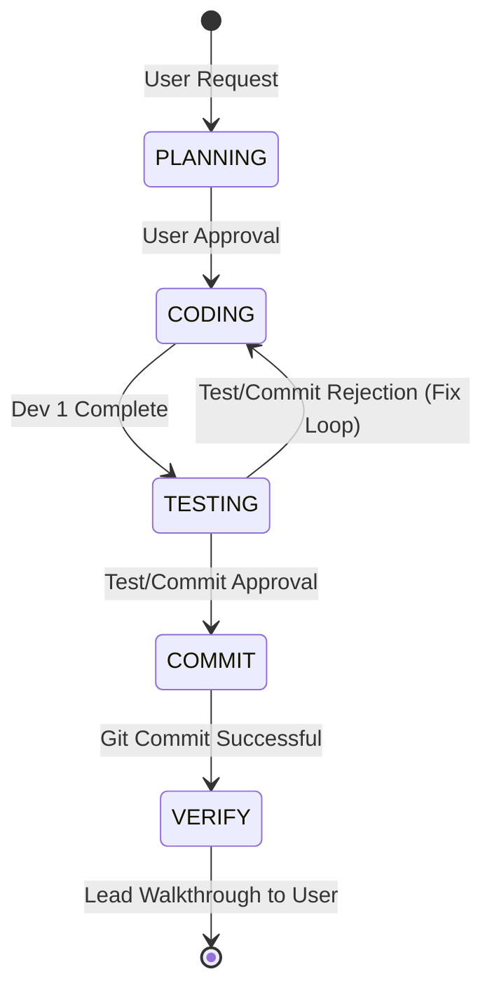

# Multi-Agent Orchestration Plan

This document defines the interaction mechanics, state machine, and communication templates for executing development workflows using the local agent team.

---

## Workflow State Machine

The Lead Agent (Antigravity) orchestrates every task using a 5-step lifecycle:



### 1. State: PLANNING
*   **Action:** Lead discusses the requirement with the User, creates `implementation_plan.md`, and secures approval.
*   **Handoff:** Lead updates `task.md` with detailed checkboxes and moves to CODING.

### 2. State: CODING
*   **Action:** Lead initializes **Dev 1** as a subagent using the system `define_subagent` tool, loading `.agents/dev1_role.md` as its prompt.
*   **Delegation Prompt:**
    ```markdown
    <role>You are Dev 1 (Surgical Coder).</role>
    <task>
    Implement [Feature Description] following the approved implementation plan: [plan link].
    Modify only: [Specific Files].
    </task>
    <instructions>
    Ensure named exports, functional paradigms, and Node 20 compliance.
    Do not touch unrelated files or write large refactors.
    </instructions>
    ```
*   **Handoff:** Dev 1 implements changes, writes the changes to files, and sends a completion message containing the modified files and rationale back to the Lead.

### 3. State: TESTING
*   **Action:** Lead receives the completion message from Dev 1. Lead initializes **Test/Commit** as a subagent using `define_subagent`, loading `.agents/test_commit_role.md` as its prompt.
*   **Testing Prompt:**
    ```markdown
    <role>You are Test/Commit (Quality & Git).</role>
    <task>
    Validate the surgical code edits made by Dev 1 in files: [Modified Files].
    </task>
    <instructions>
    1. Run local diagnostic tests: 'npm run analyze-emails:cache', 'node tests/promptTester.js', and 'node -c <files>'.
    2. Enforce complexity thresholds, token efficiency, and safety.
    3. If correct, stage files surgical-style (git add) and commit using conventional commit format.
    4. If incorrect, refuse to commit, formulate a detailed Pushback Report, and return it.
    </instructions>
    ```
*   **Handoff:** Test/Commit runs validations. If it passes, it commits and returns a **Validation & Commit Report**. If it fails, it returns a **Pushback Report** and the Lead transitions the workflow back to CODING.

### 4. State: COMMIT
*   **Action:** Once Test/Commit successfully stages and commits the code, it logs the commit hash and modified files back to the Lead.
*   **Handoff:** Lead reviews the report and moves to VERIFY.

### 5. State: VERIFY
*   **Action:** Lead compiles the completed task results, updates `task.md` and creates `walkthrough.md`.
*   **Handoff:** Lead presents the final walkthrough (including tests passed, files touched, and commits made) to the User.
